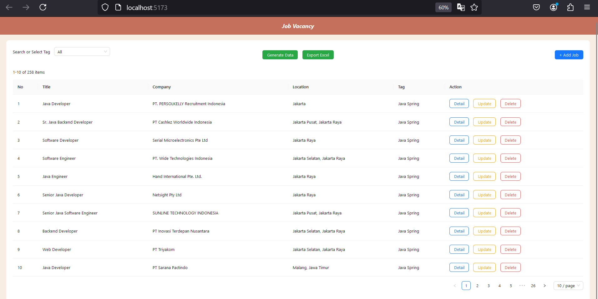
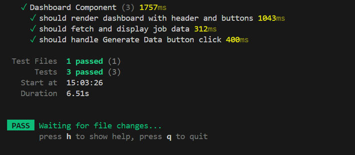
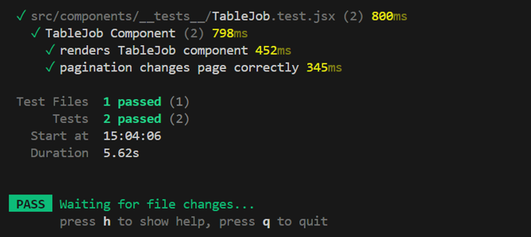

# Feeding-Data-JobStreet-Fe

This project scrapes job listings from JobStreet based on specific keywords (like JavaScript, ReactJS, Node.js, and Express), stores the data in a local database, and provides an API for managing the job data.

## Features

- CRUD operations for managing jobs
- Get generate job scraping data from JobStreet
- Export excel data jobs

## Requirements

- Node.v18.19.0
- React Vite project
- PostgreSQL database
- NPM package manager

## Getting Started

**1. Clone the repository**

**2. Install dependencies**

```
npm install
```

**3. Run the Back End side application**
Here is the github backend side link for clone

```
https://github.com/hasyaayunisonia/Feeding-Data-JobStreet
```

**4. Setup Environment Variables**
File .env

```
VITE_API_URL=http://localhost:3000
```

**5. Run the Application**
To start the application, run:

```
npm run dev
```

This will start the server on http://localhost:5173/



Here is the demonstration video

```
https://youtu.be/9zxcmMFzwxo
```

**6. Running Tests**
src/setupTests.js

```
import "@testing-library/jest-dom";
```

vite.config.js

```
...
test: {
    globals: true,
    environment: "jsdom",
    setupFiles: "./src/setupTests.jsx",
  },
...
```

To run tests, use the following command:

```
npm run test
```

Tests component dashboard for render dashboard with header and buttons, fetch and display job data, and handle Generate Data button click for show modal.


Tests component table for renders and pagination changes page correctly.

